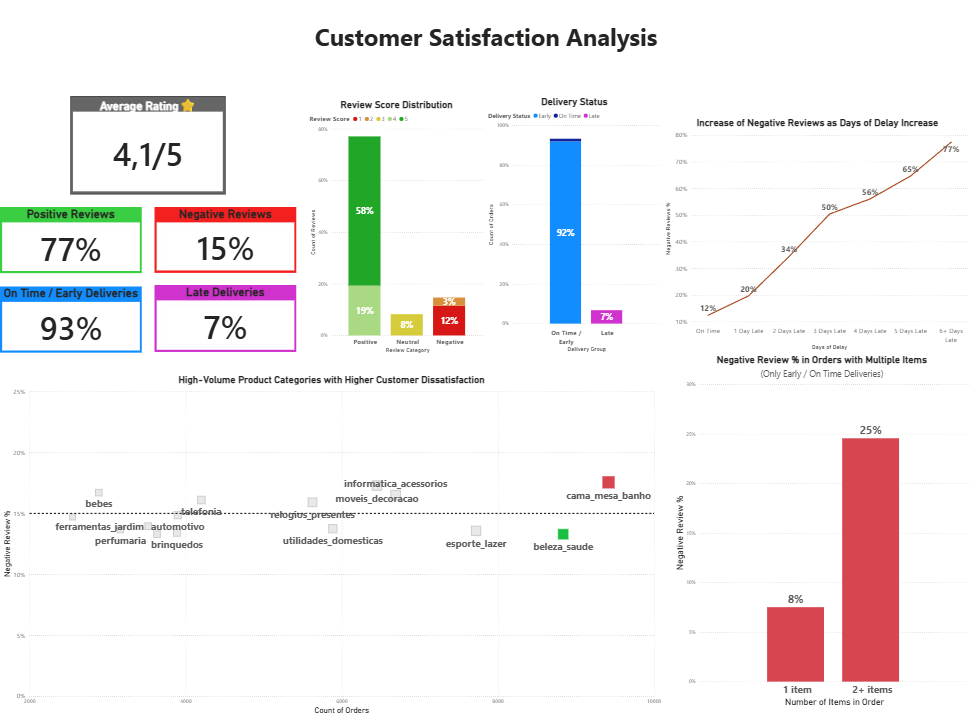

# Olist Customer Dissatisfaction Analysis

Business Intelligence project analyzing the key drivers of customer dissatisfaction in the Olist e-commerce marketplace using Power BI.

## Project Overview

This project investigates the factors that influence customer satisfaction in the Olist marketplace by analyzing customer reviews in relation to delivery performance and other order-related factors. The objective is to identify patterns that can help improve the overall customer experience.

## Business Questions

- What are the main drivers of customer satisfaction and dissatisfaction?
- How does delivery performance affect customer reviews?
- Which product categories receive the most negative reviews?
- How do order characteristics influence customer ratings?

## Tools Used

- Power BI
- Power Query
- DAX

## Dashboard Overview

This dashboard provides an overview of customer dissatisfaction in the Olist marketplace, highlighting key metrics, review distribution, delivery performance, and the main factors associated with negative customer feedback.
